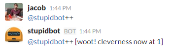
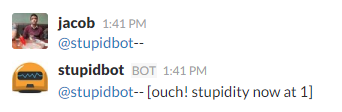
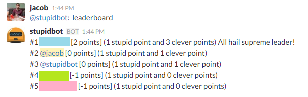

# karmabot-for-slack

karmabot-for-slack is a script for a chat bot built on the [Hubot][hubot] framework. It was initially generated by [generator-hubot][generator-hubot], and configured to be deployed on [Heroku][heroku] to get you up and running as quick as possible.

This script keeps track of users' positive and negative karma (clever points and stupid points) as well as an agregate score. Any users can give another user stupid or clever points, but cannot give themselves clever points.

[heroku]: http://www.heroku.com
[hubot]: http://hubot.github.com
[generator-hubot]: https://github.com/github/generator-hubot

## Installation 

To get this script running you should only need to copy the file `karma.coffee` into your scripts folder of your Hubot.

You will need to set the token `HUBOT_KARMA_ADMIN_NAME` to allow someone to clear the points. For example, my Slack username is `@jacob`. Therefore I would set the token to be `jacob`, ommiting the `@`:

```heroku config:add HUBOT_KARMA_ADMIN_NAME=jacob```

## Useage

### Assigning Points

To give a user clever points, simply send a message containing `@user++`. This will apply 1 clever point.



To give a user stupid points, simply send a message containing `@user--`. This will apply 1 stupid point.



After points are added, your bot will respond with a message with `@user`'s total stupid or clever points.

### Viewing the leaderboard

To see the current leaderboard for aggregate score (clever points - stupid points), send a message to your bot with the word `leaderboard`.



### Clearing assigned points

To clear all of the assigned clever and stupid points, the specified admin user can send a message to your bot `clear karma`. If a user attempts this and they are not the admin user, they will be denied.
